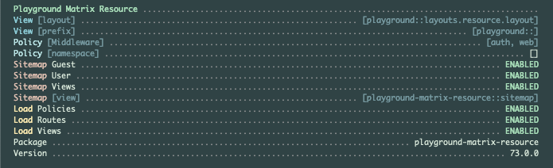

# Playground Matrix Resource


The `playground-matrix-resource` Laravel package.

This package provides an API and a Blade UI for interacting with the [Playground Matrix](https://github.com/gammamatrix/playground-matrix), a project management and task system.

If you only need the JSON API, the Blade UI may be disabled.

This application provides Swagger documentation: [swagger.json](swagger.json).
- See the [Playground Matrix Resource swagger.json on the Swagger Editor.](https://editor.swagger.io/?url=https://raw.githubusercontent.com/gammamatrix/playground-matrix-resource/develop/swagger.json)
- The endpoint models support locks, trash with force delete, restoring and more.
- Index endpoints support advanced query filtering.

## Installation

You can install the package via composer:

```bash
composer require gammamatrix/playground-matrix-resource
```

You can publish the config file with:

```bash
php artisan vendor:publish --provider="GammaMatrix\Playground\Matrix\Resource\ServiceProvider" --tag="playground-config"
```

## Configuration

All routes are enabled by default. They may be disabled via enviroment variable or the configuration.

See the contents of the published config file: [config/playground-matrix-resource.php](config/playground-matrix-resource.php)

You can publish the routes file with:
```bash
php artisan vendor:publish --provider="GammaMatrix\Playground\Matrix\Resource\ServiceProvider" --tag="playground-routes"
```
- The routes while be published in a folder at `routes/playground-matrix-resource`

### Environment Variables

#### Authentication and Authorization

| env()                                         | config()                                      |
|-----------------------------------------------|-----------------------------------------------|
| `PLAYGROUND_MATRIX_RESOURCE_MIDDLEWARE`       | `playground-matrix-resource.middleware`       |
| `PLAYGROUND_MATRIX_RESOURCE_POLICY_NAMESPACE` | `playground-matrix-resource.policy_namespace` |

If you do not want to use the flexible policies available in Playground, you may publish the routes to your base application and customize them and the middleware.

The default middleware is set in [config/playground-matrix-resource.php](config/playground-matrix-resource.php) (may also be published): `auth:sanctum,web`

If you wish to use your own policies, copy from [src/Policies](src/Policies).

#### Loading

| env()                                    | config()                                 |
|------------------------------------------|------------------------------------------|
| `PLAYGROUND_MATRIX_RESOURCE_LOAD_ROUTES` | `playground-matrix-resource.load.routes` |
| `PLAYGROUND_MATRIX_RESOURCE_LOAD_VIEWS`  | `playground-matrix-resource.load.views`  |


##### Routes

See the matrix routes: [routes](routes)

| env()                                          | config()                                       |
|------------------------------------------------|------------------------------------------------|
| `PLAYGROUND_MATRIX_RESOURCE_ROUTES_MATRIX`     | `playground-matrix-resource.routes.matrix`     |
| `PLAYGROUND_MATRIX_RESOURCE_ROUTES_BOARDS`     | `playground-matrix-resource.routes.backlogs`   |
| `PLAYGROUND_MATRIX_RESOURCE_ROUTES_EPICS`      | `playground-matrix-resource.routes.boards`     |
| `PLAYGROUND_MATRIX_RESOURCE_ROUTES_FLOWS`      | `playground-matrix-resource.routes.epics`      |
| `PLAYGROUND_MATRIX_RESOURCE_ROUTES_MILESTONES` | `playground-matrix-resource.routes.milestones` |
| `PLAYGROUND_MATRIX_RESOURCE_ROUTES_NOTES`      | `playground-matrix-resource.routes.notes`      |
| `PLAYGROUND_MATRIX_RESOURCE_ROUTES_PROJECTS`   | `playground-matrix-resource.routes.projects`   |
| `PLAYGROUND_MATRIX_RESOURCE_ROUTES_RELEASES`   | `playground-matrix-resource.routes.releases`   |
| `PLAYGROUND_MATRIX_RESOURCE_ROUTES_ROADMAPS`   | `playground-matrix-resource.routes.roadmaps`   |
| `PLAYGROUND_MATRIX_RESOURCE_ROUTES_SOURCES`    | `playground-matrix-resource.routes.sources`    |
| `PLAYGROUND_MATRIX_RESOURCE_ROUTES_SPRINTS`    | `playground-matrix-resource.routes.sprints`    |
| `PLAYGROUND_MATRIX_RESOURCE_ROUTES_TAGS`       | `playground-matrix-resource.routes.tags`       |
| `PLAYGROUND_MATRIX_RESOURCE_ROUTES_TEAMS`      | `playground-matrix-resource.routes.teams`      |
| `PLAYGROUND_MATRIX_RESOURCE_ROUTES_TICKETS`    | `playground-matrix-resource.routes.tickets`    |
| `PLAYGROUND_MATRIX_RESOURCE_ROUTES_VERSIONS`   | `playground-matrix-resource.routes.versions`   |

### UI

| env()                                       | config()                                    |
|---------------------------------------------|---------------------------------------------|
| `PLAYGROUND_MATRIX_RESOURCE_LAYOUT`         | `playground-matrix-resource.layout`         |
| `PLAYGROUND_MATRIX_RESOURCE_VIEW`           | `playground-matrix-resource.view`           |
| `PLAYGROUND_MATRIX_RESOURCE_SITEMAP_ENABLE` | `playground-matrix-resource.sitemap.enable` |
| `PLAYGROUND_MATRIX_RESOURCE_SITEMAP_GUEST`  | `playground-matrix-resource.sitemap.guest`  |
| `PLAYGROUND_MATRIX_RESOURCE_SITEMAP_USER`   | `playground-matrix-resource.sitemap.user`   |
| `PLAYGROUND_MATRIX_RESOURCE_SITEMAP_VIEW`   | `playground-matrix-resource.sitemap.view`   |


## Migrations

This package requires the migrations in [playground-matrix](https://github.com/gammamatrix/playground-matrix) a Laravel package.

## Tests

```sh
composer test
```
## About

Playground provides information in the `artisan about` command.



## Changelog

Please see [CHANGELOG](CHANGELOG.md) for more information on what has changed recently.
