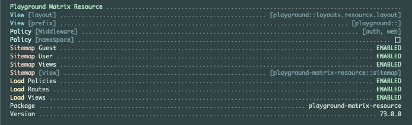

# Playground: Matrix Resource

[](https://raw.githubusercontent.com/gammamatrix/playground-matrix-resource/testing/develop/testdox.txt)
[](tests)

[//]: # ([![PHPStan Level 10]&#40;https://img.shields.io/badge/PHPStan-level%2010-brightgreen&#41;]&#40;.github/workflows/ci.yml#L128&#41;)

Playground: Matrix Resource

This package provides an API and a Blade UI for interacting with the [Playground: Matrix](https://github.com/gammamatrix/playground-matrix), a project management and task system.

If you need a project management system without a UI, then have a look at [Playground: Matrix API.](https://github.com/gammamatrix/playground-matrix-api)

## Documentation

Read more on using [Playground: Matrix Resource at Read the Docs: Playground Documentation](https://gammamatrix-playground.readthedocs.io/en/develop/components/matrix.html)

### Postman

[//]: # (A postman collection is provided in the repository: [postman-playground-matrix-resource.json.]&#40;postman-playground-matrix-resource.json&#41;)

[//]: # (- This same collection is viewable on the [Postman: GammaMatrix Playground Workspace.]&#40;https://www.postman.com/gammamatrix/workspace/playground/documentation/1185343-1e4a5656-d4e0-45b2-8f4e-daad7a6ee2b1&#41;)

### OpenAPI

This application provides OpenAPI documentation: [openapi.json](openapi.json).
- The endpoint models support locks, trash with force delete, restoring, revisions and more.
- Index endpoints support advanced query filtering.

OpenAPI API Documentation is built with npm using Redocly.
- npm is only needed to generate documentation and is not needed to operate the Playground: Matrix Resource API.

See [package.json](package.json) requirements.

Install npm.

```sh
npm install
```

Build the documentation to generate the [openapi.json](openapi.json) configuration.

```sh
npm run docs
```

Documentation
- Preview [openapi.json on the Redocly Editor UI.](https://redocly.github.io/redoc/?url=https://raw.githubusercontent.com/gammamatrix/playground-matrix-resource/develop/openapi.json)

## Installation

You can install the package via composer:

```bash
composer require gammamatrix/playground-matrix-resource
```

## `artisan about`

Playground provides information in the `artisan about` command.



## Configuration

You can publish the config file with:

```bash
php artisan vendor:publish --provider="Playground\Matrix\Resource\ServiceProvider" --tag="playground-config"
```

All routes are enabled by default. They may be disabled via enviroment variable or the configuration.

See the contents of the published config file: [config/playground-matrix-resource.php](config/playground-matrix-resource.php)

You can publish the routes file with:
```bash
php artisan vendor:publish --provider="Playground\Matrix\Resource\ServiceProvider" --tag="playground-routes"
```
- The routes while be published in a folder at `routes/playground-matrix-resource`

### Environment Variables

If you are unable or do not want to publish [configuration files for this package](config/playground-matrix-resource.php),
you may override the options via system environment variables.

Information on [environment variables is available on the wiki for this package](https://github.com/gammamatrix/playground-matrix-resource/wiki/Environment-Variables)

## Migrations

This package requires the migrations in [playground-matrix](https://github.com/gammamatrix/playground-matrix) a Laravel package.

## Cloc

```sh
composer cloc
```

```
➜  playground-matrix-resource git:(feature/GH-20) ✗ composer cloc
    1330 text files.
    1250 unique files.
     330 files ignored.

github.com/AlDanial/cloc v 2.06  T=0.40 s (3145.9 files/s, 258045.7 lines/s)
-------------------------------------------------------------------------------
Language                     files          blank        comment           code
-------------------------------------------------------------------------------
JSON                           496              0              0          39807
PHP                            470           5055           5915          23324
YAML                           163              5              0          16613
Blade                          112            721             15          10562
XML                              5              0              7            313
Markdown                         3             56              3            123
INI                              1              3              0             12
-------------------------------------------------------------------------------
SUM:                          1250           5840           5940          90754
-------------------------------------------------------------------------------
```

## PHPStan

Tests at level 10 on:
- `config/`
- `lang/`
- `resources/views/`
- `routes/`
- `src/`
- `tests/Feature/`
- `tests/Unit/`

```sh
composer analyse
```

## Coding Standards

```sh
composer format
```

## Testing

Run unit tests:
```sh
composer test
```

Run unit and feature tests:
```sh
composer test-dev
```

## Changelog

Please see [CHANGELOG](CHANGELOG.md) for more information on what has changed recently.

## License

The MIT License (MIT). Please see [License File](LICENSE.md) for more information.
